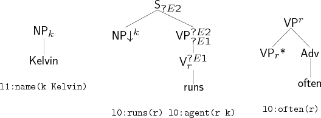

After the lexical selection phase, we move into tree assembly. The input
to this phase is the semantic formula we wish to realise, and the set of
lexically selected elementary trees. Our objective is to find every
derived tree that can be built from these parts and which is (i)
syntactically complete, meaning it has no empty substitution sites and
(ii) semantically complete, meaning that its semantics exactly matches
the input semantics. Ultimately, the goal of realisation is to produce a
set of strings, but this basically consists of concatenating the leaves
of each derived tree.

To cope with the problem of intersective modifiers, the algorithm uses
the delayed modification strategy of
(TODO: citation)
Realisation occurs in two chart
generation phases, a substitution phase (where only TAG substitutions
are performed), and an adjunction phase (likewise, TAG adjunctions
only). Separating forces the realiser to only insert modifiers into
syntactically complete structures. It also happens to be a very natural
strategy to use with TAG because adjunction and auxiliary trees are part
and parcel of the formalism. This could be seen as a potential advantage
for TAG as a generation formalism
(TODO: citation) .

We can think of the two phases as two successive chart generation problems fed
to a generic deductive parser. For clarity, here is a more procedural
description of the algorithm.  We are using agenda based control mechanism
common to many chart parsing algorithms, where the **agenda** is a data
structure for storing unprocessed intermediate results. For convenience, we
introduce a new data structure, called an **auxiliary agenda**.  The auxiliary
agenda is used to set aside any syntactically complete auxiliary trees found
during the first phase of realisation. It is not strictly necessary, but it
saves the trouble of filtering the chart afterwards. Here are the two phases in
detail:

##### Substitution phase

1.  Store the lexically selected trees in the agenda, except for
    auxiliary trees which are devoid of substitution nodes (put these in
    the auxiliary agenda).

2.  Loop: Retrieve a tree from the agenda, add it to the chart and try
    to combine it by substitution with trees present in the chart. Add
    any resulting derived tree to the agenda. Stop when the agenda is
    empty.

##### Adjunction phase

3.  Move the chart trees to the agenda and the auxiliary agenda trees on
    to the chart. Discard all trees which are not syntactically complete
    (i.e. that still have open substitution nodes), as they will never
    become complete in this phase.

4.  Loop: Retrieve a tree from the agenda, add it to the chart and try
    to combine it by adjunction with trees present in the chart. Add any
    resulting derived tree to the agenda. Stop when the agenda is empty.

The inner workings of this algorithm might be better illustrated by an
example or two:

### Kelvin runs often

Let us start with a simple one. Suppose that the input semantics is
`l0:run(r) l0:agent(r k) l0:often(r) l1:name(k Kelvin)`. Lexical
selection gives us a set of elementary trees lexicalised with the words
*Kelvin*, *often*, *runs*. The trees for *Kelvin* and
*runs* are placed on the agenda, the one for *often* is placed on the
auxiliary agenda.

We begin with the **substitution phase**, which consists of
systematically exploring the possibility of combining two trees by
substitution. Note that in the table below, the letters ‘k’, ‘r’ and ‘o’
stand for the elementary trees that correspond to *Kelvin*, *runs* and
*often*, respectively. When the trees combine, we write, for example,
‘kr’ to mean a derived tree for *Kelvin runs*. We see that here, the
tree for *Kelvin* is substituted into the one for *runs*, and the
resulting derived tree for *Kelvin runs* is placed on the agenda. Trees
on the agenda are processed one by one in this fashion, although in this
simple example, there is only one substitution to be done. When the
agenda is empty, indicating that all combinations have been tried, we
prepare for the next phase.

Combination   Agenda   Chart    AgendaA
-----------   ------   ----     -------
              k,r               o
              r,       k        o
↓(r,k)        kr       r,k      o
                       r,k,kr   o

All items containing an open substitution node are erased from the chart
(here, the tree anchored by *runs*) as there is no hope that they will
be made complete in this phase. The agenda is then reinitialised to the
content of the chart and the chart to the content of the auxiliary
agenda (here *often*). The **adjunction phase** proceeds much like the
previous phase, except that now all possible adjunctions are performed.
When the agenda is empty once more, the items in the chart whose
semantics matches the input semantics are selected, and their strings
printed out, yielding in this case the sentence *Kelvin runs often*.

Combination   Agenda   Chart    Results
-----------   ------   ----     -------
              k,kr     o
              kr       o
*(kr,o)       kro      o                 <!-- * -->
                       o        kro

Note that the chart never changes during the adjunction phase. This is
because we do not store new items onto the chart. As each tree is
removed from the agenda, either we notice that it is semantically
complete and save it as a result, or we perform all adjunction
operations involving (i) the tree and (ii) a tree from the chart, and
put any resulting derived trees back onto the agenda. The tree itself is
no longer of any use and may be discarded. We will see more implications
of this below, when we have more than one auxiliary tree that can adjoin
into the same node.

### Kelvin runs often in Colorado

Now, a slightly more complicated example. Here, we shall see auxiliary
tree with substitution nodes, as well as a lexical selection which leads
to more than one result. Our new input semantics is
`l1:name(k Kelvin) l0:often(r) l0:run(r k) l0:in(r i) l0:place(i Colorado)`
, basically the same as before with two new literals. The lexically
selected trees
are the same as before plus trees for *in* and
*Colorado*. The trees for *in*, *Colorado*, *Kelvin* and *runs* are
placed on the agenda, whereas the tree for *often* is placed on the
auxiliary agenda.

Again, the substitution phase explores all possible substitutions, of
which there are two: *Kelvin* into *runs* to get *Kelvin runs*, and
*Colorado* into *in* to get *in Colorado*. The case of *in Colorado* is
particularly interesting because it is a syntactically complete
auxiliary tree V(V\*,PP(P(in),NP(Colorado))), in the sense that it has
no open substitution sites. When we produce such trees, we transfer them
to the auxiliary agenda, so that they can be used during the adjunction
phase.

Combination  Agenda     Chart       AgendaA
-----------  ------     ----        -------
             i,c,k,r                o
             c,k,r      i           o
↓(i,c)       ic,k,r     i,c         o
             k,r        i,c         o,ic
             r          i,c,k       o,ic
↓(r,k)       kr         i,c,k,r     o,ic
                        i,c,k,r,kr  o,ic

As before, all items containing an empty substitution node are erased
from the chart (here, the trees anchored by *runs* and by *in*). The
agenda is then reinitialised to the content of the chart and the chart
to the content of the auxiliary agenda (here *often* and *in Colorado*).
The **adjunction phase** proceeds, performing all possible adjunctions.
When the agenda is empty once more, the items in the chart whose
semantics matches the input semantics are selected, and their strings
printed out, yielding in this case the sentences *Kelvin runs often in
Colorado* and *Kelvin runs in Colorado often*.

Combination         Agenda       Chart    Results
-----------         ------       ----     -------------
                    c,k,kr       o, ic
                    k,kr         o, ic
                    kr           o, ic
*(kr,o), *(kr,ic)   kro,kric     o, ic
*(kro,ic)           kroic,kric   o, ic
                    kric         o, ic    kroic
*(kric,o)           krico        o, ic    kroic
                                 o, ic    kroic, krico

Here, we get more than one result because trees can combine in different
ways (we could also get more than one result if we had an ambiguous
lexical selection, but this is not the case here). Note, by the way,
that the combinations here are a result of embedded adjunctions and not
multiple adjunctions. The fact that supports the former but not the
latter is a technical detail, and affects the number of outputs it
produces (allowing for multiple adjunctions introduces more output since
we cannot forbid embedded adjunctions), as well as the derivation trees
for the output.
