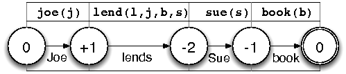
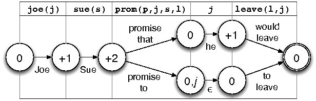

> **NOTE** *This documentation has not yet been properly
> converted from its original LateX source, nor rewritten
> for use in the manual*

We introduce a notion of polarities as a means of pre-detecting
incompatibilities between candidate trees for different propositions.
This optimisation is inserted between
[lexical selection](lexical-selection.html)
and [tree assembly](tree-assembly.html). The input to this
optimisation is the **target semantics** and the corresponding
**candidate trees**.

This whole optimisation is based on adding polarities to the grammar. We
have a set of strings which we call **polarity keys**, and some positive
or negative integers which we call **charges**. Each tree in the grammar
may assign a charge to some number of polarity keys. For example, here
is a simple grammar that uses the polarity keys n and v.

  tree                                             polarity effects
  ------------------------------------------------ ------------------
  s(n$\downarrow$, v$\downarrow$, n$\downarrow$)   -2n -v
  v(hates)                                         +v
  n(mary)                                          +n
  n(john)                                          +n

For now, these annotations are done by hand, and are based on syntactic
criteria (substitution and root node categories) but one could envisage
alternate criteria or an eventual means of automating the process.

The basic idea is to use the polarity keys to determine which subsets of
candidate trees are incompatible with each other and rule them out. We
construct a finite state automaton which uses polarity keys to
pre-calculate the compatibility of sets of trees. At the end of the
optimisation, we are left with an automaton, each path of which is a
potentially compatible set of trees. We then preform surface realisation
seperately, treating each path as a set of candidate trees.

*Important note*: one thing that may be confusing in this chapter is
that we refer to polarities (charges) as single integers, e.g, $-2n$. In
reality, to account for weird stuff like atomic disjunction, we do not
use simple integers, but polarities intervals, so more something like
$(-2,-2)n$! But for the most part, the intervals are zero length, and
you can just think of $-2n$ as shorthand for $(-2,-2)n$.

## Building a polarity automaton

The basic process for constructing a polarity automaton is
as follows:

1.  Build a seed automaton (section {sec:seed\_automaton}).

2.  For each polarity key, elaborate the automaton with the polarity
    information for that key (section {sec:automaton\_construction}) and
    minimise the automaton (section {sec:automaton\_pruning}).

The above process can be thought of as a more efficient way of
constructing an automaton for each polarity key, minimising said
automaton, and then taking their intersection. In any case, we return
everything a tuple with (1) a list of the automota that were created (2)
the final automaton (3) a possibly modified input semantics. The first
item is only neccesary for debugging; only the last two are important.

## Polarity automaton

We construct a finite state automaton for each
polarity key that is in the set of trees. It helps to imagine a table
where each column corresponds to a single proposition.

   `gift(g)`                     `cost(g,x)`           `high(x)`
   ----------------------------- --------------------- ------------------------
   *the gift*    +1np            *the cost of*         *is high*        -1np
   *the present* +1np            *costs*        -1np   *a lot*
                                                       *much*

Each column (proposition) has a different number of cells which
corresponds to the lexical ambiguity for that proposition, more
concretely, the number of candidate trees for that proposition. The
{polarity automaton} describes the different ways we can traverse the
table from column to column, choosing a cell to pass through at each
step and accumulating polarity along the way. Each state represents the
polarity at a column and each transition represents the tree we chose to
get there. All transitions from one columns $i$ to the next $i+1$ that
lead to the same accumulated polarity lead to the same state.

### Columns

We build the columns for the polarity automaton as follows. Given a
input semantics `sem` and a list of trees `cands`, we group the trees by
the first literal of sem that is part of their tree semantics.

Note: this is not the same function as Tags.mapBySem! The fact that we
preserve the order of the input semantics is important for our handling
of multi-literal semantics and for semantic frequency sorting.

### Initial Automaton

{sec:seed\_automaton} We first construct a relatively trivial polarity
automaton without any polarity effects. Each state except the start
state corresponds to a literal in the target semantics, and the
transitions to a state consist of the trees whose semantics is subsumed
by that literal.

### Construction

{sec:automaton\_construction} {sec:automaton\_intersection} The goal is
to construct a polarity automaton which accounts for a given polarity
key $k$. The basic idea is that given literals $p_1..p_n$ in the target
semantics, we create a start state, calculate the states/transitions to
$p_1$ and succesively calculate the states/transitions from proposition
$p_x$ to $p_{x+1}$ for all $1 < x < n$.

<!-- _ -->
The ultimate goal is to construct an automaton that accounts for
multiple polarity keys. The simplest approach would be to calculate a
seperate automaton for each key, prune them all and then intersect the
pruned automaton together, but we can do much better than that. Since
the pruned automata are generally much smaller in size, we perform an
iterative intersection by using a previously pruned automaton as the
skeleton for the current automaton. This is why we don’t pass any
literals or candidates to the construction step; it takes them directly
from the previous automaton. See also section {sec:seed\_automaton} for
the seed automaton that you can use when there is no “previous
automaton”.

### Pruning

Any path through the automaton which does not
lead to final polarity of zero sum can now be eliminated. We do this by
stepping recursively backwards from the final states:

## Zero-literal semantics

Lexical items with a **null semantics** typically correspond to functions
words: complementisers “John likes **to** read.”, subcategorised
prepositions “Mary accuses John **of** cheating.“

Such items need not
be lexical items at all. We can exploit TAG’s support for trees with
multiple anchors, by treating them as co-anchors to some primary lexical
item. The English infinitival *to*, for example, can appear in the tree
*to take* as s(comp(to),v(take),np$\downarrow$).

On the other hand, pronouns have a {zero-literal} semantics, one which
is not null, but which consists only of a variable index. For example,
the pronoun *she* in ({ex:pronoun\_pol\_she}) has semantics {s} and in
({ex:pronoun\_pol\_control}), {he} has the semantics {j}.

1. `joe(j) sue(s) book(b) lend(l j b s) boring(b)`  
   Joe lends Sue a boring book.

2. `joe(j)        book(b) lend(l j b s) boring(b)`  
   Joe lends her a boring book.

3. `joe(j), sue(s), leave(l,j), promise(p,j,s,l)`  
   - Joe promises Sue to leave.
   - Joe promises Sue that he would leave.

In the figure below, we compare the
construction of polarity automata for ({ex:pronoun\_pol\_sue}, left) and
({ex:pronoun\_pol\_she}, right). Building an automaton for
({ex:pronoun\_pol\_she}) fails because {sue} is not available to cancel
the negative polarities for {lends}; instead, a pronoun must be used to
take its place. The problem is that the selection of a lexical items is
only triggered when the construction algorithm visits one of its
semantic literals. Since pronoun semantics have zero literals, they are
*never* selected. Making pronouns visible to the construction algorithm
would require us to count the indices from the input semantics. Each
index refers to an entity. This entity must be “consumed” by a syntactic
functor (e.g. a verb) and “provided” by a syntactic argument (e.g. a
noun).

We make this explicit by annotating the semantics of the lexical input
(that is the set of lexical items selected on the basis of the input
semantics) with a form of polarities. Roughly, nouns provide indices[^1]
($+$), modifiers leave them unaffected, and verbs consume them ($-$).
Predicting pronouns is then a matter of counting the indices. If the
positive and negative indices cancel each other out, no pronouns are
required. If there are more negative indices than positive ones, then as
many pronouns are required as there are negative excess indices. In the
table below, we show how the example semantics above may be annotated
and how many negative excess indices result:

Counting surplus indices allows us to establish the number of pronouns
used and thus gives us the information needed to build polarity
automata. We implement this by introducing a virtual literal for
negative excess index, and having that literal be realised by pronouns.
Building the polarity automaton as normal yields lexical combinations
with the required number of pronouns, as in figure
{fig:polarity\_automaton\_zerolit}.

{different\_sem\_annotations} The sitation is more complicated where the
lexical input contains lexical items with different annotations for the
same semantics. For instance, the control verb {promise} has two forms:
one which solicits an infinitive as in {promise to leave}, and one which
solicits a declarative clause as in {promise that he would leave}. This
means two different counts of subject index {j} in
({ex:pronoun\_pol\_control}) : zero for the form that subcategorises for
the infinitive, or one for the declarative. But to build a single
automaton, these counts must be reconciled, i.e., how many virtual
literals do we introduce for {j}, zero or one? The answer is to
introduce enough virtual literals to satisfy the largest demand, and
then use the multi-literal extension to support alternate forms with a
smaller demand. To handle example ({ex:pronoun\_pol\_control}), we
introduce one virtual literal for {j} so that the declarative form can
be produced, and treat the soliciting {promise} as though its semantics
includes that literal along with its regular semantics (figure
{fig:polarity\_automaton\_zerolit\_promise}). In other words, the
infinitive-soliciting form is treated as if it already fulfils the role
of a pronoun, and does not need one in its lexical combination.

We insert pronouns into the input semantics using the following process:

1.  For each literal in the input semantics, establish the smallest
    charge for each of its semantic indices.

2.  Cancel out the polarities for every index in the input semantics.

3.  Compensate for any uncancelled negative polarities by an adding an
    additional literal to the input semantics – a pronoun – for every
    negative charge.

4.  Finally, deal with the problem of lexical items who require fewer
    pronouns than predicted by inserting the excess pronouns in their
    extra literal semantics (see page {different\_sem\_annotations})

## Further optimisations

### Automatic detection

Automatic detection is not an optimisation in itself, but a means to
make grammar development with polarities more convenient.

Our detection process looks for attributes which are defined on *all*
subst and root nodes of the lexically selected items. Note that this
should typically give you the `cat` and `idx` polarities. It is only
used to give you hints about what features you may want to consider
using in the graphical interface.

##### The polarity values

First the simplified explanation: we assign every tree with a $-1$
charge for every category for every substitution node it has.
Additionally, we assign every initial tree with a $+1$ charge for the
category of its root node. So for example, the tree s(n$\downarrow$,
cl$\downarrow$, v(aime), n$\downarrow$) should have the following
polarities: s +1, cl -1, n -2. These charges are added to any that
previously been defined in the grammar.

Now what really happens: we treat automaton polarities as intervals, not
as single integers! For the most part, nothing changes from the
simplified explanation. Where we added a $-1$ charge before, we now add
a $(-1,-1)$ charge. Similarly, we where added a $+1$ charge, we now add
$(1,1)$.

So what’s the point of all this? It helps us deal with atomic disjunction.
Suppose we encounter a substitution node whose category is either cl or n.
What we do is add the polarities $cl (-1,0),  n (-1,0)$ which means that there
are anywhere from -1 to 0 cl, and for n.

### Chart sharing

Chart sharing is based on the idea that instead of performing a seperate
generation task for each automaton path, we should do single generation
task, but annotate each tree with set of the automata paths it appears
on. We then allow trees on the same paths to be compared only if they
are on the same path

### Semantic sorting

To minimise the number of states in the polarity automaton, we could
also sort the literals in the target semantics by the number of
corresponding lexically selected items. The idea is to delay branching
as much as possible so as to mimimise the number of states in the
automaton.

Let’s take a hypothetical example with two semantic literals: bar
(having two trees with polarties 0 and +1). foo (having one tree with
polarity -1) and If we arbitrarily explored bar before foo (no semantic
sorting), the resulting automaton could look like this:

         bar     foo
    (0)--+---(0)------(-1)
         |               
         +---(1)------(0)

With semantic sorting, we would explore foo before bar because foo has
fewer items and is less likely to branch. The resulting automaton would
have fewer states.

         foo      bar
    (0)-----(-1)--+---(-1)
                  |        
                  +---(0)

The hope is that this would make the polarity automata a bit faster to
build, especially considering that we are working over multiple polarity
keys.

Note: we have to take care to count each literal for each lexical
entry’s semantics or else the multi-literal semantic code will choke.

## Details

We can define the polarity automaton as a NFA, or a five-tuple
$(Q, \Sigma, \delta, q_0, q_n)$ such that

1.  $Q$ is a set of states, each state being a tuple $(i,e,p)$ where $i$
    is an integer (representing a single literal in the target
    semantics), $e$ is a list of extra literals which are known by the
    state, and $p$ is a polarity.

2.  $\Sigma$ is the union of the sets of candidate trees for all
    propositions

3.  $q_0$ is the start state $(0,[0,0])$ which does not correspond to
    any propositions and is used strictly as a starting point.

4.  $q_n$ is the final state $(n,[x,y])$ which corresponds to the last
    proposition, with polarity $x \leq 0 \leq y$.

5.  $\delta$ is the transition function between states, which we define
    below.

[^1]: except for predicative nouns, which like verbs, are semantic
    functors
